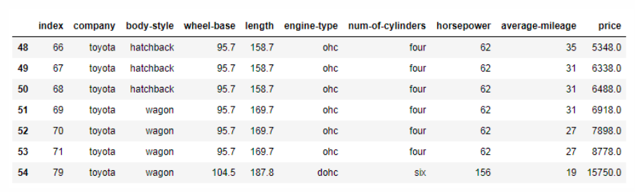

**EXO1** : 
À partir de l'ensemble de données du fichier `Automobile_data.csv`, affichez les *cinq premières* et les *cinq dernières lignes*

**EXO2** : Trouver le nom de l'entreprise automobile la plus chère
 
Affichez le nom et le prix de la société de la voiture la plus chère.  

Résultat attendu :  
|    | company       | price   |
|----|---------------|---------|
| 35 | Mercedes-benz | 45400.0 |

**EXO3** : Afficher tous les détails des voitures Toyota
 
Résultat attendu :  

